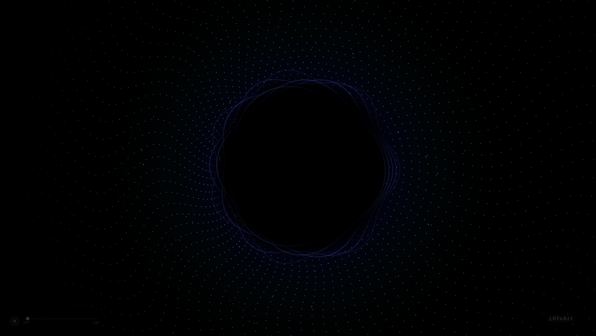

# LofXArt

<p align="center">
  <a href="https://dmprintace.github.io/Lofxart/" target="_blank">
    
  </a>
</p>

<p align="center">
  <a href="https://dmprintace.github.io/Lofxart/">
    <strong>▶ Lancer l'expérience en ligne</strong>
  </a>
</p>

<p align="center">
  
  
  
  
  
</p>

---

## Présentation

**LofXArt** est une expérience artistique abstraite mêlant **musique**, **code**, **animation visuelle** et **interaction utilisateur**.

Le projet n'a pas pour but de proposer un outil classique ou une application utile au sens traditionnel.  
Il s'agit plutôt d'une création libre, expérimentale et immersive, pensée pour partager une ambiance visuelle et auditive générée avec du code.

L'utilisateur clique pour lancer l'expérience, puis la musique démarre pendant qu'une animation réactive au son prend vie à l'écran.

---

## Accès direct

L'expérience est disponible ici :

### [https://dmprintace.github.io/Lofxart/](https://dmprintace.github.io/Lofxart/)

---

## Démonstration vidéo

<p align="center">
  <video src="assets/demo.mp4" controls width="900">
    Votre navigateur ne supporte pas la lecture vidéo.
  </video>
</p>

Si la vidéo ne s'affiche pas directement sur GitHub, elle reste disponible dans le dossier :

```text
assets/demo.mp4
```

---

## Concept

L'idée du projet est simple :

> Créer une expérience abstraite où le son influence le visuel, sans objectif précis autre que ressentir, regarder, écouter et explorer.

LofXArt mélange plusieurs éléments :

- une ambiance noire et immersive ;
- une animation générative en plein écran ;
- des particules lumineuses ;
- une réaction visuelle au rythme audio ;
- une interaction au clic ;
- une identité artistique minimaliste.

---

## Technologies utilisées

Ce projet est volontairement simple et léger.  
Il fonctionne directement dans le navigateur avec :

| Technologie | Rôle |
|---|---|
| HTML | Structure de la page |
| CSS | Design, placement et ambiance visuelle |
| JavaScript | Animation, audio et interactions |
| Canvas API | Rendu graphique dynamique |
| Web Audio API | Analyse audio et réaction visuelle |
| GitHub Pages | Hébergement gratuit du projet |

---

## Structure du projet

```text
LofXArt/
├── index.html
├── audio/
│   └── down-now-Remix.mp3
├── assets/
│   ├── preview.png
│   └── demo.mp4
└── README.md
```

---

## Utilisation

Aucune installation n'est nécessaire.

Il suffit d'ouvrir le lien :

[https://dmprintace.github.io/Lofxart/](https://dmprintace.github.io/Lofxart/)

Puis de cliquer sur :

```text
CLIQUEZ POUR LANCER L'EXPÉRIENCE
```

L'audio démarre et l'animation se lance directement dans le navigateur.

---

## Objectif artistique

Ce projet existe avant tout pour le plaisir de créer.

Il rassemble deux univers que j'aime :

- la musique ;
- le visuel génératif.

**LofXArt** est une création libre, abstraite et personnelle.  
Il n'y a pas de règle précise, pas de finalité imposée, simplement une envie de partager une expérience sonore et visuelle.

---

## Auteur

Créé par **Dmprint**.

GitHub : [@dmprintAce](https://github.com/dmprintAce)

---

<p align="center">
  <strong>Code • Son • Lumière • Abstraction</strong>
</p>
